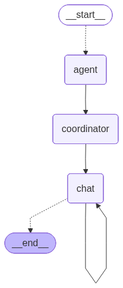
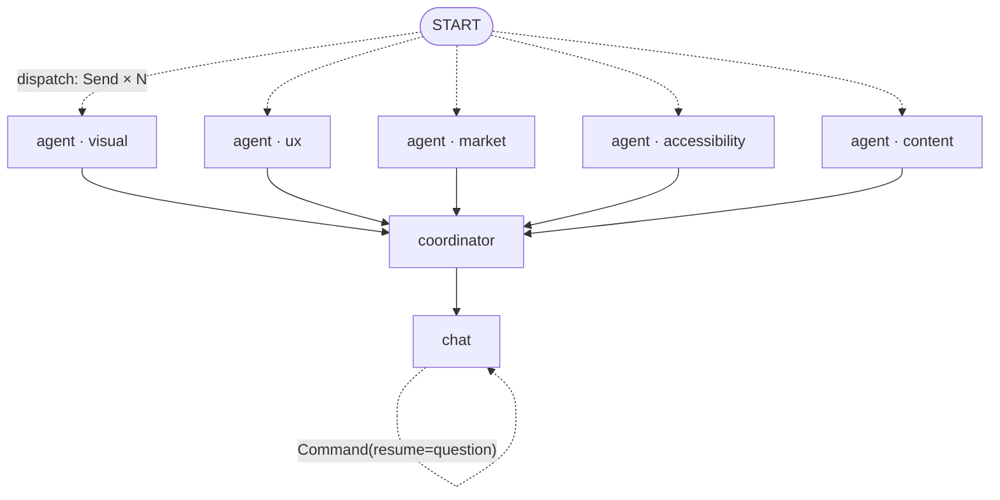

# 🎯 Multimodal AI Design Analysis Suite

A production-grade, **multi-agent** tool that critiques UI/UX designs from
screenshots. A LangGraph fleet of specialist agents reasons over your screens
through different lenses, **grounds** every finding in established design
principles (retrieved from a vector knowledge base), and a coordinator merges
everything into one prioritised, actionable report — with citations. You can
then chat with the report; the graph keeps full session context.

Built on **LangGraph** (orchestration + human-in-the-loop + persistence),
**LangChain** (`ChatOpenAI` → OpenRouter, structured output, streaming),
**LanceDB** (vector RAG), and **Streamlit** (UI). Default model: `gpt-4o-mini`.

---

## What it does

Upload one or more product/app screens and the suite runs five specialists
concurrently:

| Agent | Lens | Grounded in |
|-------|------|-------------|
| **Visual Analysis** | layout, spacing, hierarchy, typography, colour | Gestalt, visual hierarchy, type scale |
| **UX Critique** | flows, friction, cognitive load, dark patterns | Nielsen's 10 heuristics, Hick/Fitts/Zeigarnik/Jakob/Miller |
| **Market Research** | value prop, CTAs, positioning, conversion | CRO & messaging best practice |
| **Compliance & Accessibility** | contrast, target size, colour-alone | WCAG 2.2 AA/AAA |
| **Content & Microcopy** | copy clarity, labels, error/empty states, tone | UX-writing & microcopy guidelines |

A **coordinator** node then de-duplicates overlapping findings (semantically,
via embeddings), prioritises by severity/effort, extracts *quick wins*, scores
the design, and writes a streamed executive summary. Every finding carries a
concrete recommendation and the principles it cites.

The result view is split into two tabs — **Critique report** (findings,
annotated screens, cost & latency) and **Improved design** (the optional
redesign agent). The UI ships a sleek dark theme using Tailwind's default font
stack, with Material Symbols icons throughout.

---

## Improved design (redesign agent)

From the report you can, on demand, generate an improved, high-fidelity mockup
that applies the prioritised fixes. The redesign agent runs **outside** the
LangGraph graph (a plain function call after a report exists) and offers two
output formats:

- **Image mockup** — an image-output model (`REDESIGN_MODEL`, default
  `google/gemini-2.5-flash-image`) returns a rendered concept. Image generation
  bypasses LangChain (which doesn't surface returned images) and calls
  OpenRouter's `/chat/completions` directly with `modalities: ["image","text"]`.
- **HTML mockup** — the vision chat model emits a single self-contained HTML
  document (real, selectable text — no garbled glyphs) that renders live in the
  browser, with a code view and a download button.

Both modes build the same **bounded** prompt from the review (≤8 prioritised
fixes, ≤6 specialist recommendations) to keep cost predictable, send only the
primary screenshot, report cost + latency, and never raise to the UI (failures
surface as a message). It's an **AI concept for direction**, not production art.

---

## Cost & latency

Every run surfaces a **Cost & latency** table (one row per agent + the
coordinator, plus a total). Each graph node records token usage and the
wall-clock of its model call into a `usage` channel
(`Annotated[list, operator.add]`, merged across the parallel agents). Cost is an
approximate estimate from `config.PRICING` (USD per 1M tokens, specific-before-
general substring match) — a display aid, not a bill. Because the specialists run
in parallel, their latencies overlap and don't sum to wall-clock.

---

## Inputs & annotated output

- **Multiple images** — upload several screenshots at once, and/or **paste
  directly from the clipboard** (the `streamlit-paste-button` component; HTTPS or
  localhost required for clipboard access). Pasted shots are de-duplicated and
  added to the batch; a thumbnail strip shows everything queued.
- **Marked-up screens** — each agent returns an optional normalized bounding box
  (`region`) for issues it can locate. The result view draws severity-coloured
  boxes and **numbered pins** on each screen and bakes a **comments legend**
  ("N. [severity] title — fix") into a single downloadable PNG, so you get a
  shareable, corrected-guidance image per screen. Findings that aren't tied to a
  region are listed below the image.

---

## Why LangGraph / LangChain (production posture)

The orchestration is a `StateGraph`, which buys real production properties
instead of hand-rolled plumbing:

- **Map-reduce fan-out.** `dispatch` emits one `Send("agent", …)` per selected
  agent (the map); a `reports: Annotated[list, operator.add]` reducer collects
  them safely (the reduce). Parallel agents can't clobber each other's writes.
- **Human-in-the-loop, native.** The chat node calls `interrupt()` to pause and
  await a question, and resumes on `Command(resume=question)`. No threads, no
  queues, no custom event protocol.
- **Durable session memory.** A checkpointer persists the entire state — reports,
  consolidated report, and chat history — per `thread_id`. Swap `InMemorySaver`
  for `SqliteSaver`/`PostgresSaver` and sessions survive restarts; interrupts
  become resumable across processes.
- **Streaming for free.** `stream_mode="messages"` taps the model's token stream
  inside nodes, so the executive summary and chat answers stream live without
  extra code. `stream_mode="updates"` reports node completion for the progress UI.
- **Fixed response format, enforced.** Agents use
  `ChatOpenAI.with_structured_output(AgentReport)`, so the framework validates
  output into a strict Pydantic schema. Chat answers follow a fixed prose
  contract ending in a `Next:` action line.

---

## Architecture

**Compiled graph** (rendered by `scripts/draw_graph.py` →
`graph.get_graph().draw_mermaid_png()`):



It shows a single `agent` node, not five: the specialists are a **dynamic
fan-out**. `dispatch` emits one `Send("agent", …)` per selected agent at runtime,
so the same `agent` node executes N times in parallel — the compiled graph only
knows the node, not how many instances each run spawns. The runtime view:



The five agents are declared in `src/agents/specs.py` (`VISUAL`, `UX`, `MARKET`,
`ACCESSIBILITY`, `CONTENT`) and registered in the `SPECS` dict; `dispatch` looks
each one up by name. Detailed flow:

```
                       ┌──────────────────────────────┐
                       │        Streamlit UI           │  app.py
                       │  upload · model · agents      │
                       └───────────────┬───────────────┘
                                       │ graph.stream(updates + messages)
                                       ▼
   START ──dispatch (Send × N)──▶  agent  ─┐
                                   agent   ├─▶ coordinator ─▶ chat ⇄ chat
                                   agent   │   (fan-in)        (interrupt loop)
                                   agent  ─┘
        each agent:                    │  dedup · score ·          │ interrupt()
        retrieve grounding (LanceDB)   │  stream summary           │ await question
        → ChatOpenAI.with_structured   ▼                           ▼
          _output(AgentReport)    ConsolidatedReport         grounded streamed
        → append to reports[]                                 answer + history
                                                                    │
                              checkpointer (thread_id) ◀────────────┘
                              persists reports + report + messages
```

- `src/graph/state.py` — `CritiqueState` with `operator.add` reducers for the
  `reports` and `usage` fan-in and `add_messages` for the chat channel.
- `src/graph/nodes.py` — `dispatch`, `agent_node`, `coordinator_node`, `chat_node`
  (each node also records a per-call cost/latency `usage` record).
- `src/graph/builder.py` — wires the graph and compiles it with a checkpointer.
- `src/core/llm.py` — `LLMFactory` (ChatOpenAI → OpenRouter) + multimodal messages
  + `generate_image` (direct OpenRouter image transport).
- `src/agents/specs.py` — the five agents as declarative `AgentSpec` data.
- `src/agents/critique.py` — pure dedup/score logic + summary & answer prompts.
- `src/agents/redesign.py` — the opt-in redesign agent (image + HTML), outside the graph.
- `src/rag/` — LanceDB knowledge base + seeded principle corpus (with citations).
- `src/core/schemas.py` — the Pydantic structured-output contract.
- `config.py` — settings + the `PRICING` table and `estimate_cost`/`price_for` helpers.

### Design patterns
Map-reduce (Send + reducer) · human-in-the-loop interrupt loop · Repository
(`KnowledgeBase` hides LanceDB) · Factory (`LLMFactory`) · dependency injection
(factory + kb injected into node closures) · declarative agents (data, not
subclasses).

---

## Setup

You need **Python 3.10+** and an OpenRouter key (<https://openrouter.ai/keys>).

### 1. Create & activate a virtual environment

**Windows (PowerShell):**
```powershell
python -m venv .venv
.\.venv\Scripts\Activate.ps1
# if activation is blocked once:  Set-ExecutionPolicy -Scope Process RemoteSigned
```

**macOS / Linux (bash):**
```bash
python3 -m venv .venv
source .venv/bin/activate
```

You'll know it worked when your prompt shows `(.venv)`.

### 2. Install dependencies

```bash
pip install -r requirements.txt
```

### 3. Create the `.env` file

Create a file named `.env` in the project root with at least your key:

```env
OPENROUTER_API_KEY=sk-or-...your-key...

# optional overrides (defaults shown)
CRITIQUE_MODEL=openai/gpt-4o-mini
REDESIGN_MODEL=google/gemini-2.5-flash-image
```

(You can skip `.env` entirely and paste the key into the sidebar at runtime.)

### 4. Run

```bash
streamlit run app.py
```

It opens at <http://localhost:8501>. The first run downloads a small local
embedding model (`all-MiniLM-L6-v2`) and builds the LanceDB knowledge base under
`./.lancedb` — no embedding API calls or extra keys needed.

---

## Configuration

`config.py` (overridable via `.env`). Highlights:

- `CRITIQUE_MODEL` — default model (`openai/gpt-4o-mini`); switchable in the UI.
- `REDESIGN_MODEL` — image-output model for the redesign agent
  (default `google/gemini-2.5-flash-image`). The HTML redesign reuses the
  selected critique model.
- `STRUCTURED_OUTPUT_METHOD` — `function_calling` (default, tool-capable models)
  or `json_mode` for models without tool support.
- `RETRIEVAL_K`, `DEDUP_THRESHOLD`, `LLM_TEMPERATURE`, `LLM_MAX_TOKENS`.

All listed models in `SUPPORTED_MODELS` are vision-capable (agents read images).
Approximate per-model prices live in `config.PRICING` (USD per 1M tokens) and feed
the cost table — keep specific slugs before general ones (first substring wins).

---

## Extending it

**Add an agent** — one `AgentSpec` entry in `src/agents/specs.py` (this is exactly
how the **Content & Microcopy** agent was added):

```python
CONTENT = AgentSpec(
    name="Content & Microcopy Agent", category="content",
    retrieval_query="microcopy clarity tone voice labels error messages",
    role_prompt="You are a UX content strategist auditing clarity, tone, and labels...",
)
# add it to the SPECS dict — the generic agent node runs it, no new class.
```

**Add knowledge** — append entries to `SEED_KNOWLEDGE` in `src/rag/seed_data.py`
(each with a `kb_id`, `category`, and real `source`/`url`); they're embedded and
become citable. A new agent `category` (e.g. `content`) should get a few matching
seed entries so its findings are grounded.

**Production persistence** — swap `InMemorySaver` in `build_graph` for
`SqliteSaver`/`PostgresSaver` to persist sessions and resume interrupts across
restarts. **Tracing** — set `LANGSMITH_API_KEY` / `LANGSMITH_TRACING=true` and
every node run is traced in LangSmith.

---

## Testing

```bash
PYTHONPATH=. python tests/test_logic.py    # dedup, scoring, export (pure logic)
PYTHONPATH=. python tests/test_graph.py    # full graph: fan-out, coordinator, usage, interrupt chat
PYTHONPATH=. python tests/test_annotate.py # box + pin + legend rendering (headless PIL)
PYTHONPATH=. python tests/test_cost.py     # pricing: specific-before-general, estimate_cost
PYTHONPATH=. pytest tests/test_redesign.py # redesign prompt bounds + image/HTML runners (faked)
# or, if installed:  pytest
```

`test_graph.py` runs the compiled LangGraph end to end with a fake model and KB:
it asserts both agents fan in, the coordinator consolidates, citations are
backfilled, the graph pauses at the chat interrupt, and resuming with
`Command(resume=...)` answers and persists the turn. No network or models.

---

## Notes & limitations

- Image-only accessibility checks are heuristic; some WCAG criteria need the live
  DOM — the agent flags these rather than guessing.
- Critique quality scales with the model; `gpt-4o-mini` is a strong, cheap
  default. Switch to `gpt-4o` or `claude-3.5-sonnet` for harder critiques.
- `with_structured_output` defaults to function calling; for a model without tool
  support set `STRUCTURED_OUTPUT_METHOD=json_mode`.
- The cost table is an **approximate** estimate from a hand-maintained price map
  (`config.PRICING`), not a bill; the redesign image uses OpenRouter's exact cost
  when returned. The local embedder and LanceDB are free.
- The redesign is an AI concept for direction — there's no verification that each
  finding was applied; image models can garble text (use the HTML mode for real
  copy), and very large HTML mockups may truncate (flagged in the UI).
